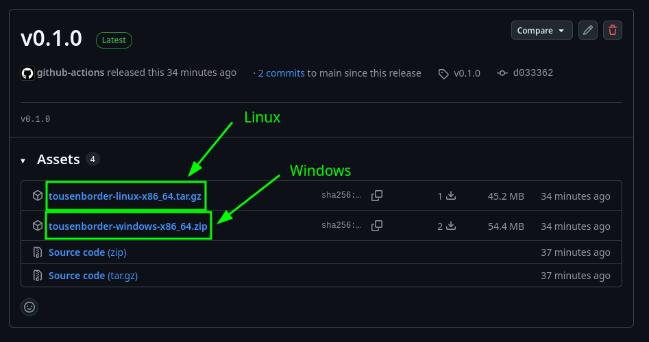

# とーせんぼーだー — セキュリティ審査ゲーム

情報を集めてALLOW / BLOCKを判断するセキュリティ審査ゲームです．


## 今すぐ遊ぶ

### 1. [Release](https://github.com/toratako/tousenborder/releases/)からファイルをダウンロードします．

- Windowsの場合: `tousenborder-windows-x86_64.zip`
- Linuxの場合: `tousenborder-linux-x86_64.tar.gz`



### 2. ダウンロードしたファイルを展開し，`tousenborder.exe`/`tousenborder.x86_64` をダブルクリックして実行します．

---

## 起動方法 (開発)

Godot 4.7.2とjustを用意し，`just run`．素材・スクリプトのインポートと教材検証後に起動します．  
justを使わない場合:

```sh
godot --headless --path . --editor --import --quit
godot --path .
```

初回・スクリプト追加後のクラス未登録エラーはインポートで更新します．

## 教材の追加・変更

1. `data/problems/` に問題JSONを置く．Packへの登録は自由演習には不要です．
2. `python3 scripts/build_problem_catalog.py` で一覧を再生成し，`just validate` と `just test` します．
3. 再ビルドするとその問題が組み込まれたゲームが生成されます．

最小限の資料付き問題:

<details>
<summary>例: EXAMPLE-FILE.json</summary>

```json
{
    "schema_version": 2,
    "id": "EXAMPLE-FILE",
    "category": "file",
    "platform": "common",
    "title": "受入れ可能な文書",
    "request": "この文書を受け入れてよいか判断してください．",
    "initial": {
        "information": [
            {
                "id": "filename",
                "label": "ファイル名",
                "value": "report.pdf",
                "data_type": "file"
            }
        ]
    },
    "resources": [
        {
            "id": "format",
            "kind": "references",
            "name": "受入れ規則",
            "result": { "content": "この受付ではPDFを受け入れます．" }
        }
    ],
    "required_evidence": ["format"],
    "ground_truth": "allow",
    "explanation": "PDFという受入れ条件と一致します．"
}
```

</details>

`category` は自由なIDで，必要なら `category_label` を置きます．  
`difficulty` は `very_beginner`（超初級）・`beginner`（初級）・`applied`（応用），省略は未評価となります．  
`learning_objectives / sources / inspired_by` は作問・出典追跡用で判定条件には使われません．  
資料は `resources` に置き，`kind` は `tools (ツール) / references (資料) / external_references (外部照会)` が選択可能です．

その他，詳しくは [教材データ](data/README.md) を参照してください．

## 関連ドキュメント

- [作問・検証](docs/problem-data.md) スキーマ，入力の接続例，一覧の再生成
- [問題一覧](docs/problem-catalog.md)：問題JSONから生成する分野・調査形式・正解の索引
- [学習設計](docs/learning-design.md)：判定時点，教材の制約，未実装の拡張計画
- [学習支援](docs/learning-support.md)：用語集・審査履歴の編集先
- [実行時の処理](docs/runtime-flow.md)：OS条件，状態管理，変更箇所の索引

Python 3.11以上を使います．ゲームの起動・エクスポートにPythonの開発用依存は不要です．

```sh
python3 -m pip install -r requirements-dev.txt
just validate # 共通ローダで教材と生成一覧を検証
just test     # Python・Godotの全テスト
just format   # GDScript（gdscript-formatter がある場合）と Python を整形
```

## ビルド

使用中のGodotと同じバージョンのエクスポートテンプレートが必要です．

```sh
just install-templates # 公式テンプレートを取得（Python・ネットワークが必要）
just build            # 教材検証後，Linux / Windowsを出力
just clean            # build/ 以下を削除
```

`build/linux/tousenborder.x86_64` と `build/windows/tousenborder.exe` が生成されます．PCKを内包します．
