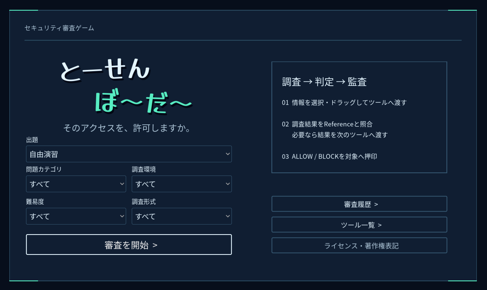

# とーせんぼ～だ～ — セキュリティ審査ゲーム

情報を集めてALLOW / BLOCKを判断するセキュリティ審査ゲームです．



## 今すぐ遊ぶ (Windows)

### 1. [Release](https://github.com/toratako/tousenborder/releases/)から `tousenborder-windows-x86_64.zip` をダウンロードします．


### 2. ダウンロードしたZIPを展開し，`tousenborder.exe` をダブルクリックして実行します．

---

## 起動方法 (開発)

Godot 4.7.2とjustを用意し，`just run`．素材・スクリプトのインポートと教材検証後に起動します．  
justを使わない場合:

```sh
godot --headless --path . --editor --import --quit
godot --path .
```

初回・スクリプト追加後のクラス未登録エラーはインポートで更新します．

## 開発・教材編集

- [作問・検証](docs/problem-data.md) スキーマ，入力の接続例，一覧の再生成
- [問題一覧](docs/problem-catalog.md)：問題JSONから生成する分野・調査形式・正解の索引
- [学習設計](docs/learning-design.md)：判定時点，教材の制約，未実装の拡張計画
- [学習支援](docs/learning-support.md)：用語集・審査履歴の編集先
- [実行時の処理](docs/runtime-flow.md)：OS条件，状態管理，変更箇所の索引

Python 3.11以上を使います．ゲームの起動・エクスポートにPythonの開発用依存は不要です．

```sh
python3 -m pip install -r requirements-dev.txt
just validate # 共通ローダで教材と生成一覧を検証
just test     # Python・Godotの全テスト
just format   # GDScript（gdscript-formatter がある場合）と Python を整形
```

## ビルド

使用中のGodotと同じバージョンのエクスポートテンプレートが必要です．

```sh
just install-templates # 公式テンプレートを取得（Python・ネットワークが必要）
just build            # 教材検証後，Linux / Windowsを出力
just clean            # build/ 以下を削除
```

出力は `build/linux/tousenborder.x86_64` と `build/windows/tousenborder.exe`．PCKを内包します．
