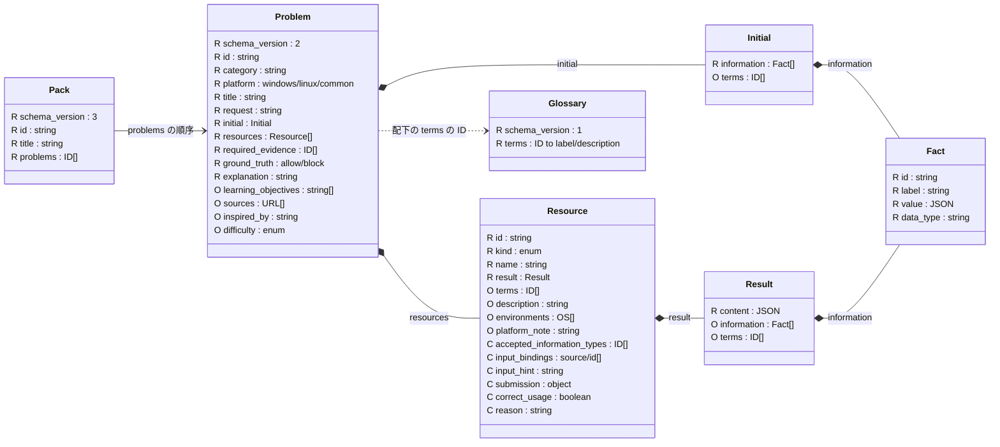

# 教材データ

`problems/` が単独で遊べる問題の正本．`packs/*/pack.json` は同じ読込元の問題IDを出題順に並べる任意の索引で，問題本体を複製しない．図の `R` は必須，`O` は任意，`C` は `kind` によって必須になる項目．

`Resource.kind` は `references / tools / external_references`．`references` は入力不要．後二者は `accepted_information_types / input_bindings / input_hint` が必須で，`external_references` はさらに `submission / correct_usage / reason` が必須．`correct_usage` を指定する場合も `reason` が必要．`input_bindings` は `{source, id}` の配列，`submission` は `{type, warning}`．

`required_evidence` は資料ID，`initial_information`，または `evidence_alternatives` のIDを参照する．`inspired_by` を使う場合は `sources` が必要．`difficulty` 省略は未評価．同じ問題IDをPack内で繰り返せる．

- [schemas/](schemas/) が形式の正本．特に [problem.schema.json](schemas/problem.schema.json) と [pack.schema.json](schemas/pack.schema.json)．履歴は [history.schema.json](schemas/history.schema.json) で検証し，`user://history/` に保存する．
- [glossary/security.json](glossary/security.json) は共通用語．`initial / resource / result` の `terms` が用語IDを示し，各定義は `label / description` を持つ．問題固有の定義は任意の `Problem.glossary` に置く．
- [help/rules.json](help/rules.json) は画面共通の規則．教材の追加・ZIP構成と検証は [教材データ](../docs/problem-data.md) を参照．
