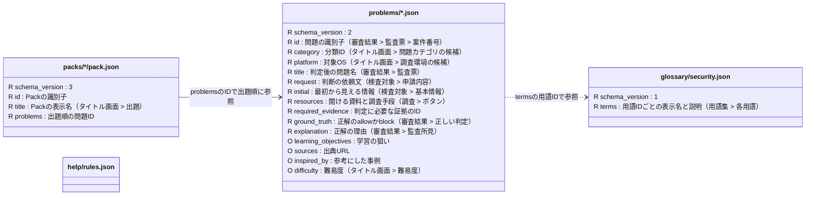

# 教材データ

`problems/*.json` は1ファイルで1問を表し，単独で遊べる．`packs/*/pack.json` は問題IDを出題順に並べる任意の索引で，問題の中身は持たない．
図の各箱は**1種類のJSONファイル**を表す．`R` は必須，`O` は任意のフィールド．
括弧内は主なUI表示場所で，記載のないフィールドは画面に直接表示されない．

例えば [learning/pack.json](packs/learning/pack.json) の `FILE-WIN-DOUBLE-EXTENSION` は，[同じIDの問題ファイル](problems/FILE-WIN-DOUBLE-EXTENSION.json) を指す．

`help/rules.json` は全問題に共通するヘルプの配列（各項目は `id / label / value`）で，UIでは「規則集 > セキュリティ運用規則」に表示する．Problemから参照するフィールドはない．

Problemファイル内の主なまとまり:

| 場所 | 内容 |
| --- | --- |
| `initial.information[]` | 開始時に使える情報（検査対象 > 基本情報）．各項目の `id` は参照用，`label` は表示名，`value` は値，`data_type` はツールへ渡すときの型． |
| `resources[]` | `id` は証拠や入力元の参照先，`kind` は参照資料・調査ツール・外部照会の区別，`name` は表示名（調査 > ボタン），`result` は開いた結果．任意の `description` はボタンのツールチップ，`environments` は表示する調査OS，`platform_note` はツール一覧の利用環境に使う． |
| `resources[].result` | 必須の `content` が表示内容（解析結果 > 本文）．任意の `information[]` は結果から得て次の調査にも渡せる情報（解析結果 > 各情報）で，各項目は初期情報と同じ形． |
| `initial / resources[] / resources[].result` の `terms[]` | 用語ID（用語集 > 各用語）．共通の定義は `glossary/security.json`，問題固有の定義は任意の `Problem.glossary` に置く． |

`resources[].kind` は `references`（読むだけの資料），`tools`（情報を渡す調査），`external_references`（外部照会）．  
後二者は，受け付ける情報の型 `accepted_information_types`，渡せる情報を `{source, id}` で指定する `input_bindings`，入力案内 `input_hint`（調査 > ボタンの入力案内）が必須．  
外部照会ではさらに送信対象と注意を示す `submission`（送信前の確認），利用の適否 `correct_usage` とその理由 `reason`（審査結果 > 監査所見）が必須になる．

`required_evidence` は資料ID，`initial_information`，または任意の `evidence_alternatives` でまとめた代替証拠のIDを参照する．  
`inspired_by` を書く場合は `sources` も必要．`difficulty` の省略は未評価を意味する．

問題の `title` は判定前の検査対象カードには出さず，監査票と結果画面の「問題ごとの振り返り」に出る．  
「正しい判定」と「監査所見」は表示設定により隠れる場合がある．  

形式の詳細は [Problem](schemas/problem.schema.json)・[Pack](schemas/pack.schema.json)・[用語集](schemas/glossary.schema.json) のスキーマ，追加手順とZIP構成は [教材データの手引き](../docs/problem-data.md) を参照．プレイ履歴は教材とは別に [history.schema.json](schemas/history.schema.json) で検証し，`user://history/` に保存する．
