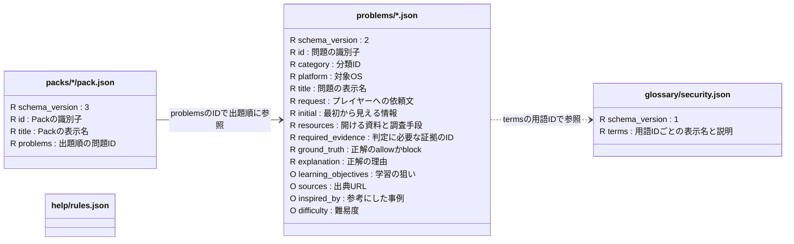

# 教材データ

`problems/*.json` は1ファイルで1問を表し，単独で遊べる．`packs/*/pack.json` は問題IDを出題順に並べる任意の索引で，問題の中身は持たない．図の各箱は**1種類のJSONファイル**を表す（`*` は複数のファイル）．`R` は必須，`O` は任意のフィールド．

例えば [learning/pack.json](packs/learning/pack.json) の `FILE-WIN-DOUBLE-EXTENSION` は，[同じIDの問題ファイル](problems/FILE-WIN-DOUBLE-EXTENSION.json) を指す．

`help/rules.json` は全問題に共通するヘルプの配列（各項目は `id / label / value`）で，Problemから参照するフィールドはない．`schemas/` は各JSONの形式の正本であり，教材ファイルではない．

Problemファイル内の主なまとまり:

| 場所 | 内容 |
| --- | --- |
| `initial.information[]` | 開始時に使える情報．各項目の `id` は参照用，`label` は表示名，`value` は値，`data_type` はツールへ渡すときの型． |
| `resources[]` | `id` は証拠や入力元の参照先，`kind` は参照資料・調査ツール・外部照会の区別，`name` は表示名，`result` は開いた結果．任意の `description` は補足，`environments / platform_note` はOS別の表示に使う． |
| `resources[].result` | 必須の `content` が表示内容．任意の `information[]` は結果から得て次の調査にも渡せる情報で，各項目は初期情報と同じ形． |
| `initial / resources[] / resources[].result` の `terms[]` | 用語ID．共通の定義は `glossary/security.json`，問題固有の定義は任意の `Problem.glossary` に置く． |

`resources[].kind` は `references`（読むだけの資料），`tools`（情報を渡す調査），`external_references`（外部照会）．後二者は，受け付ける情報の型 `accepted_information_types`，渡せる情報を `{source, id}` で指定する `input_bindings`，入力案内 `input_hint` が必須．外部照会ではさらに送信対象と注意を示す `submission`，利用の適否 `correct_usage`，その理由 `reason` が必須になる．

`required_evidence` は資料ID，`initial_information`，または任意の `evidence_alternatives` でまとめた代替証拠のIDを参照する．`inspired_by` を書く場合は `sources` も必要．`difficulty` の省略は未評価を意味する．

形式の詳細は [Problem](schemas/problem.schema.json)・[Pack](schemas/pack.schema.json)・[用語集](schemas/glossary.schema.json) のスキーマ，追加手順とZIP構成は [教材データの手引き](../docs/problem-data.md) を参照．プレイ履歴は教材とは別に [history.schema.json](schemas/history.schema.json) で検証し，`user://history/` に保存する．
